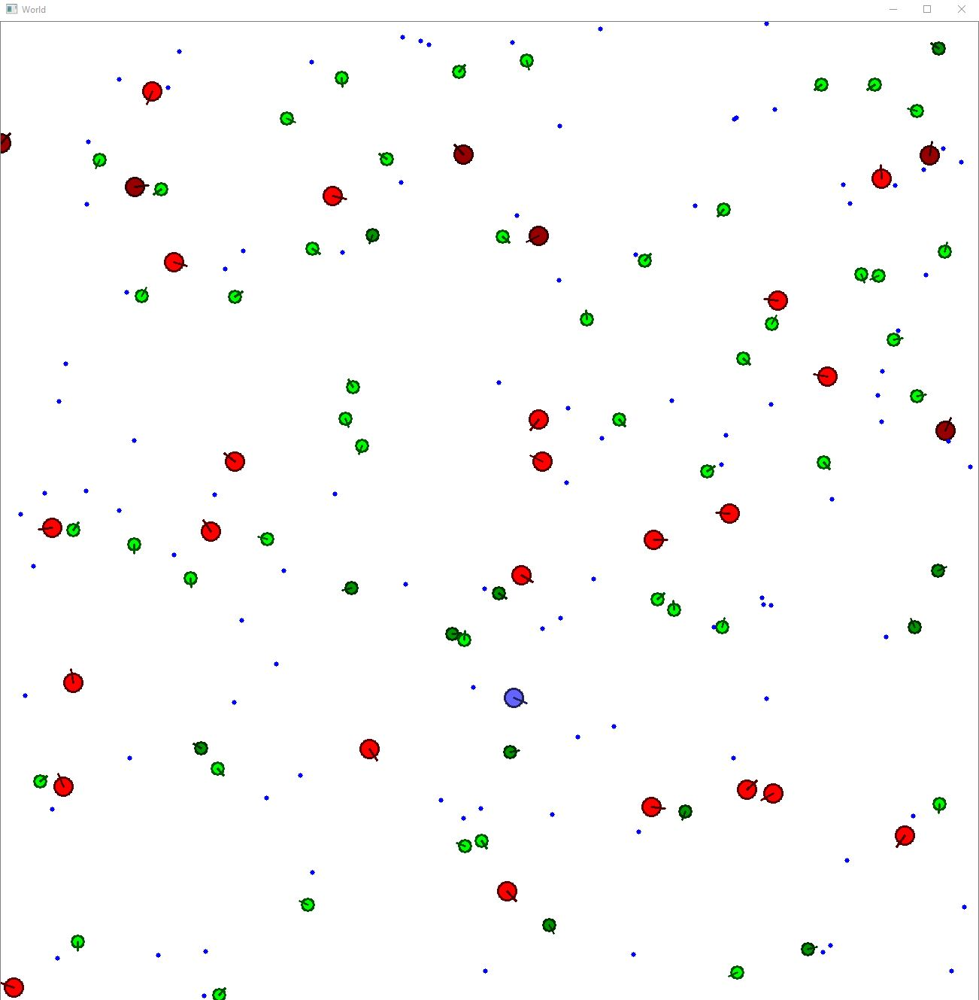

# Evolving Life
Organisms' neural network brains evolve with genetic algorithms

A lot of code is copied from Nathan Rooy. [repo](https://github.com/nathanrooy/evolving-simple-organisms)/[blog](https://nathanrooy.github.io/posts/2017-11-30/evolving-simple-organisms-using-a-genetic-algorithm-and-deep-learning/)

#### The main changes I made:
1. Made the NN brain more complex and easy to adjust.
2. Improved the genetic evolution of the NN weight matrix using [this paper](https://www.ijcai.org/Proceedings/89-1/Papers/122.pdf).
3. Added predator oganisms. Red predators try to eat the green "herbavores" which try to eat the small blue food. (If you're R/G colorblind, the predators are bigger.)
4. The world is visualized using opencv which is a lot faster.

